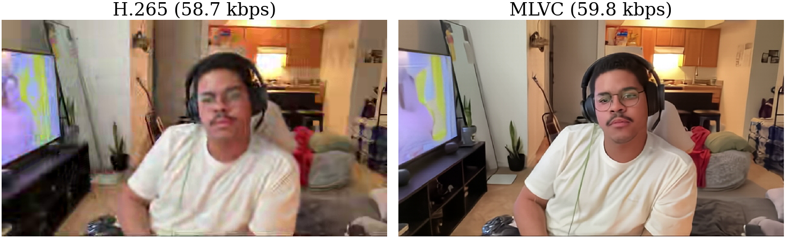
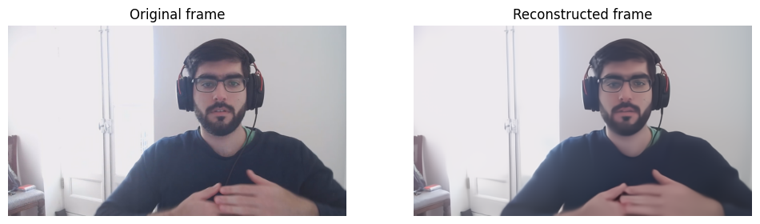

# Multi-platform Learned Video Codec (MLVC)

[](https://arxiv.org/abs/2606.28027)



**Neural video codec with real-time performance and hardware robustness across diverse consumer devices.**

MLVC achieves >70% MOS-based BD-rate improvement over hardware HEVC while averaging around 100 FPS for both encoding and decoding on commodity NPUs from Apple, Intel, and Qualcomm (540p).

This repository provides:
- **Pre-trained checkpoints** for inference
- **Training code:** Full pipeline for image and video model training (also works with [DCVC-RT](https://github.com/microsoft/DCVC))
- **Conversion tools:** Export to CoreML (Apple), ONNX for OpenVINO (Intel) and QNN (Qualcomm)
- **C++ entropy coder:** Production-ready, optimized for real-time deployment
- **Benchmarking tools:** BD-rate computation, RD curves, quality metrics, and anchors

## Installation

### Setup

1. Install uv: https://docs.astral.sh/uv/getting-started/installation/
2. Requires Python >=3.12, <3.14
3. Clone repository:
```bash
git clone https://github.com/microsoft/mlvc.git
cd mlvc
```
4. Install dependencies (choose your ONNX Runtime backend)
```bash
uv sync --extra onnxruntime              # CPU
uv sync --extra onnxruntime-gpu          # NVIDIA GPU
uv sync --extra onnxruntime-qnn          # Qualcomm NPU
uv sync --extra onnxruntime-openvino     # Intel NPU
uv sync --extra onnxruntime-windowsml    # Windows ML (GPU or NPU)
```
5. To produce actual bitstreams, you need to install the entropy coder (requires C++ compiler)
```bash
uv pip install packages/msrtc_rans
```
6. Install pre-commit hooks (for development)

Copy `.pre-commit-config-example.yaml` to `.pre-commit-config.yaml` before installing the hooks.

```bash
uv run pre-commit install
```
7. Activate virtual environment from .venv directory or use `uv run ...` instead of `python ...` (preferred)

## Minimal Example



See [`demo.ipynb`](video/notebooks/demo.ipynb) for a walkthrough.


## Models

| Model | Objective | Parameters | Weights | SHA-256 |
| --- | --- | ---: | --- | --- |
| MLVC | psnr | 18.3M | [mlvc-psnr-v1.ckpt](https://mlvideopub.blob.core.windows.net/mlvc/models/mlvc-psnr-v1.ckpt) | `834adaab680837c4106a9bb62e5778b3f13729b4fe6f751797e0747214f5cca1` |
| MLVC | perceptual | 18.3M | [mlvc-perceptual-v1.ckpt](https://mlvideopub.blob.core.windows.net/mlvc/models/mlvc-perceptual-v1.ckpt) | `0ba781769a12ae40548d3f6f92e56594510b926bf72ddb92717c7ebccde4723e` |
| MLVC-S | psnr | 5.4M | [mlvc-s-psnr-v1.ckpt](https://mlvideopub.blob.core.windows.net/mlvc/models/mlvc-s-psnr-v1.ckpt) | `1b86b757ddb115342293efb57719d6216c6ee2e459ae796ec41723b5c05ca896` |
| MLVC-S | perceptual | 5.4M | [mlvc-s-perceptual-v1.ckpt](https://mlvideopub.blob.core.windows.net/mlvc/models/mlvc-s-perceptual-v1.ckpt) | `cfe12eed07b00cdb98c0cd07136797f3b49e8d52f7b6bd3b81cf0a5312a4aa7c` |

**Note:** The checkpoints listed above were trained on OpenVid. The technical report used models trained on Vimeo.

## Training

Run commands from the `video/` directory.

### Directory layout

Paths in dataset configurations are resolved relative to `--data_mount`.
Model checkpoints, anchors, and training outputs are resolved relative to `--checkpoints_mount`.

```text
~/mlvc/
├── data/                         # --data_mount ~/mlvc
│   ├── OpenVidHD/
│   └── VCD/
└── job-outputs/                  # --checkpoints_mount ~/mlvc/job-outputs
    ├── pretrained/
    ├── benchmark_test/
    │   └── anchor/
    └── checkpoints/
```

### Prepare training data

You should move all downloaded datasets to `~/mlvc/data`.

##### OpenVidHD

Download OpenVidHD data from [here](https://huggingface.co/datasets/nkp37/OpenVid-1M/tree/main/OpenVidHD) - see details and further steps in [BUILD_TRAIN_DATASET.md](video/BUILD_TRAIN_DATASET.md).

### Prepare validation and test data

##### HEVC

Follow instructions [here](https://stackoverflow.com/questions/66693808/where-can-i-get-test-sequences-for-hevc).

##### VCD

The original VCD dataset is available from the [VCD repository](https://github.com/microsoft/VCD).
Prepared versions used by this project are available at: [360p](https://mlvideopub.blob.core.windows.net/mlvc/VCD/640x360_30fps.tar), [540p](https://mlvideopub.blob.core.windows.net/mlvc/VCD/960x540_30fps.tar) and [720p](https://mlvideopub.blob.core.windows.net/mlvc/VCD/1280x720_30fps.tar).

Extract the required resolutions under:

```
~/mlvc/data/VCD/yuv/
├── 640x360_30fps/
├── 960x540_30fps/
└── 1280x720_30fps/
```

#### Anchors

Anchor files contain results from a reference codec and are used to calculate BD-rate.
We provide `intel_hw_hevc` anchors for VCD [360p](https://mlvideopub.blob.core.windows.net/mlvc/anchors/vcd/640x360_30fps/intel_hw_hevc-v1.json), [540p](https://mlvideopub.blob.core.windows.net/mlvc/anchors/vcd/960x540_30fps/intel_hw_hevc-v1.json), and [720p](https://mlvideopub.blob.core.windows.net/mlvc/anchors/vcd/1280x720_30fps/intel_hw_hevc-v1.json), and `DCVC-RT` anchors for [96-frame HEVC sequences](https://mlvideopub.blob.core.windows.net/mlvc/anchors/hevc/dcvcrt_with_iframe_metrics_recommended_yuv420.json) and [48-frame VCD-s1 360p sequences](https://mlvideopub.blob.core.windows.net/mlvc/anchors/vcd/640x360_30fps/dcvcrt_with_iframe_metrics_VCD_640x360_30fps_40s48f.json).
Download anchors to the corresponding path under `~/mlvc/job-outputs/benchmark_test/anchor/`.

### Prepare auxiliary models

Auxiliary models are workflow-specific. You do not need to download all of them.

#### DCVC-RT I-frame model

Download the [`cvpr2025_image.pth.tar` checkpoint](https://1drv.ms/f/c/2866592d5c55df8c/Esu0KJ-I2kxCjEP565ARx_YB88i0UnR6XnODqFcvZs4LcA?e=by8CO8) provided by the [DCVC project](https://github.com/microsoft/DCVC), rename it to `DMCI-6.0.pth.tar`, and place it in `~/mlvc/job-outputs/pretrained/`.

#### LPIPS

LPIPS is required only for perceptual training or LPIPS evaluation.
Download the LPIPS VGG16 weights file [`vgg.pth`](https://github.com/richzhang/PerceptualSimilarity/blob/master/lpips/weights/v0.1/vgg.pth) from the [PerceptualSimilarity project](https://github.com/richzhang/PerceptualSimilarity), rename it to `lpips_vgg16.pth`, and place it in `~/mlvc/job-outputs/pretrained/`.

#### DeQA-Score

We provide experimental support for the [DeQA-Score](https://github.com/zhiyuanyou/DeQA-Score) no-reference metric which uses LLaMa2-7B.
Download the weights from their [HuggingFace page](https://huggingface.co/zhiyuanyou/DeQA-Score-Mix3) and place them in `~/mlvc/job-outputs/pretrained/DeQA-Score-Mix3`.

#### Face segmentation

FarL and RetinaFace are needed only to generate face segmentation masks or to calculate face-region metrics without precomputed masks.
Download the face detector [mobilenet0.25_Final.pth](https://github.com/biubug6/Pytorch_Retinaface) and face parser [face_parsing.farl.lapa.main_ema_136500_jit191.pt](https://github.com/FacePerceiver/facer/releases/download/models-v1/face_parsing.farl.lapa.main_ema_136500_jit191.pt) and move them to `~/mlvc/job-outputs/pretrained/checkpoints`.

### Train I-Frame Model

```bash
python train_image.py \
  --config configs/train_image-dcvcrt.yaml \
  --data_mount ~/mlvc \
  --checkpoints_mount ~/mlvc/job-outputs \
  --save_dir checkpoints/dmci
```

### Train P-Frame Model

```bash
python train_video.py \
  --config configs/train_video-mlvc.yaml \
  --data_mount ~/mlvc \
  --checkpoints_mount ~/mlvc/job-outputs \
  --save_dir checkpoints/mlvc
```

Perceptual fine-tuning configuration is shown in [train_video-mlvc-perceptual.yaml](video/configs/train_video-mlvc-perceptual.yaml), MLVC-S model configuration is shown in [train_video-mlvc_s.yaml](video/configs/train_video-mlvc_s.yaml).

## Evaluation

### Run Evaluation

```bash
python train_video.py \
  --config configs/test_video-mlvc.yaml \
  --validate \
  --data_mount ~/mlvc \
  --checkpoints_mount ~/mlvc/job-outputs
```

### Supported Metrics

- **Distortion**: PSNR (Y/U/V/RGB), MS-SSIM, LPIPS, VIF, DeQA
- **Rate**: Bits per pixel (bpp), estimated and actual bitstream
- **Efficiency**: BD-rate against anchors (we provide H.265 anchor)

### Compute metrics for encoded videos

```bash
python compute_benchmark_metrics.py --config configs/compute_benchmark_metrics.yaml
```

### Compute optical flow, DeQA and texture complexity for training/validation frame sequences

```bash
python calculate_frame_sequence_metrics.py --config configs/dataset/calculate_frame_sequence_metrics.yaml
```

## Model conversion

### Prerequisites

By default, local job outputs and test data directories are located at `~/mlvc/job-outputs/` and `~/mlvc/test-set/`, respectively. To override these locations, use the `VIDEO_JOB_OUTPUTS_DIR` and `TEST_DATA_DIR` environment variables or provide the `--job-outputs-dir` and `--test-data-dir` command line arguments to the `convert.py` script.

Model defaults are read from `model_configs.yaml`.
Use `model_configs_example.yaml` as a template and configure an absolute local weights_path and a weights_version.

### Model export

Getting started:

```bash
python convert.py export --model-version dmc61sbr_reglu --model-type onnx --weights-path ~/mlvc/job-outputs/pretrained/mlvc-psnr-v1.ckpt
```

Examples:


```bash
# Example 1: Export with different model type and target device. Note that running inference for CoreML and Intel models requires the NPU.
python convert.py export --model-version dmc61sbr_reglu --model-type coreml --target-device apple
python convert.py export --model-version dmc61sbr_reglu --model-type onnx --target-device intel
python convert.py export --model-version dmc61sbr_reglu --model-type onnx --target-device qualcomm

# Example 2: Export model with custom size (the model is fully convolutional, but NPUs expect fixed sizes)
python convert.py export --model-version dmc61sbr_reglu --model-width 640 --model-height 368
python convert.py export --model-version dmc61sbr_reglu --model-width 320 --model-height 192

# Example 3: Override the checkpoint configured for the model
python convert.py export --model-version dmc61sbr_reglu --weights-path /absolute/path/to/mlvc-psnr-v1.ckpt

# Example 4: Enable model benchmark after conversion
python convert.py export --model-version dmc61sbr_reglu --benchmark

# Other options
python convert.py export --help
```

### Model testing (examples based on CoreML)

```bash
# Example 1: Run conversion validation test
python convert.py test --model-path ./output/models/dmc61sbr_reglu-local/coreml-apple/640x368 validate_conversion

# Example 2: Run profile
python convert.py test --model-path ./output/models/dmc61sbr_reglu-local/coreml-apple/640x368 profile

# Example 3: Benchmark (uses NPU by default)
python convert.py test --model-path ./output/models/dmc61sbr_reglu-local/coreml-apple/640x368 benchmark

# Example 4: Benchmark on GPU
python convert.py test --model-path ./output/models/dmc61sbr_reglu-local/coreml-apple/640x368 --coreml-compute-units gpu benchmark

# Example 5: Run validation test (calculate BD-rate against anchor)
python convert.py test --model-path ./output/models/dmc61sbr_reglu-local/coreml-apple/640x368 run_validation_test

# Example 6: Run validation test and save MLVC bitstream and reconstructed YUV frames (for model debug data, add --save-debug-data)
python convert.py test --model-path ./output/models/dmc61sbr_reglu-local/coreml-apple/640x368 run_validation_test --save-output-data --save-yuv
```

### Model bundles

```bash
# Example: Prepare a model bundle
python convert.py bundle --model-version dmc61sbr_reglu
python convert.py bundle --model-version dmc61sbr_reglu --skip-if-exists  # Skip conversion of individual models, if exists
python convert.py bundle --model-version dmc61sbr_reglu --mlvc-version v0.1
python convert.py bundle --model-version dmc61sbr_reglu --model-type coreml --target-device apple
python convert.py bundle --model-version dmc61sbr_reglu --model-type onnx --target-device intel
python convert.py bundle --model-version dmc61sbr_reglu --model-type onnx --target-device qualcomm

# Example: Test 640x368 from the model bundle
python convert.py test --model-path ./output/model_bundles/dmc61sbr_reglu-local-coreml-apple-v0.0 --model-id 640x368 validate_conversion

# Help
python convert.py bundle --help
```

### Development

#### Run unit tests

```bash
python -m pytest tests/test_conversion.py --disable-warnings
```

## Citation

If you use this code in your research, please cite:

```bibtex
@misc{parnamaa2026mlvc,
  title={MLVC: Multi-platform Learned Video Codec for Real-World Deployment},
  author={Tanel P{\"a}rnamaa and Martin Lumiste and Ardi Loot and Evgenii Indenbom and Andrei Znobishchev and Ando Saabas},
  year={2026},
  eprint={2606.28027},
  archivePrefix={arXiv},
  url={https://arxiv.org/abs/2606.28027},
}
```

## Acknowledgments

- [DCVC-RT](https://github.com/microsoft/DCVC) was the starting point for MLVC development.
- Entropy coding implementation adapted from [ryg_rans](https://github.com/rygorous/ryg_rans).

## Contributing

This project welcomes contributions and suggestions.  Most contributions require you to agree to a
Contributor License Agreement (CLA) declaring that you have the right to, and actually do, grant us
the rights to use your contribution. For details, visit [Contributor License Agreements](https://cla.opensource.microsoft.com).

When you submit a pull request, a CLA bot will automatically determine whether you need to provide
a CLA and decorate the PR appropriately (e.g., status check, comment). Simply follow the instructions
provided by the bot. You will only need to do this once across all repos using our CLA.

This project has adopted the [Microsoft Open Source Code of Conduct](https://opensource.microsoft.com/codeofconduct/).
For more information see the [Code of Conduct FAQ](https://opensource.microsoft.com/codeofconduct/faq/) or
contact [opencode@microsoft.com](mailto:opencode@microsoft.com) with any additional questions or comments.

## Trademarks

This project may contain trademarks or logos for projects, products, or services. Authorized use of Microsoft
trademarks or logos is subject to and must follow
[Microsoft's Trademark & Brand Guidelines](https://www.microsoft.com/legal/intellectualproperty/trademarks/usage/general).
Use of Microsoft trademarks or logos in modified versions of this project must not cause confusion or imply Microsoft sponsorship.
Any use of third-party trademarks or logos are subject to those third-party's policies.
